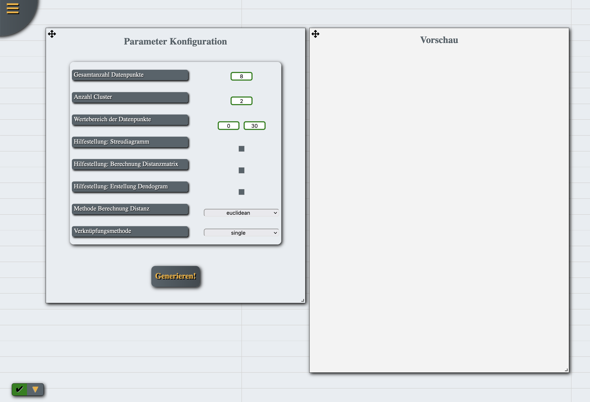
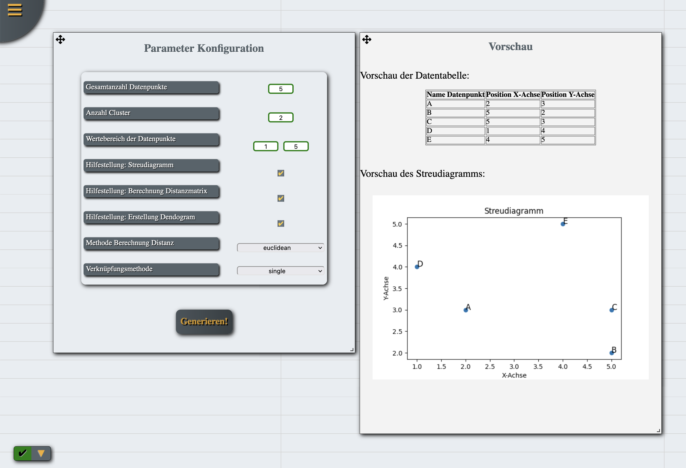
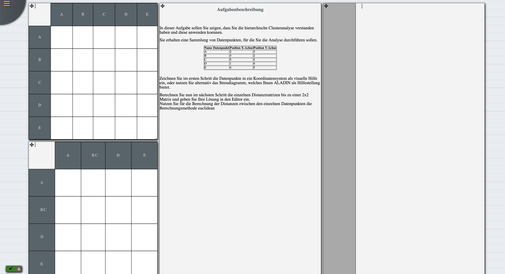
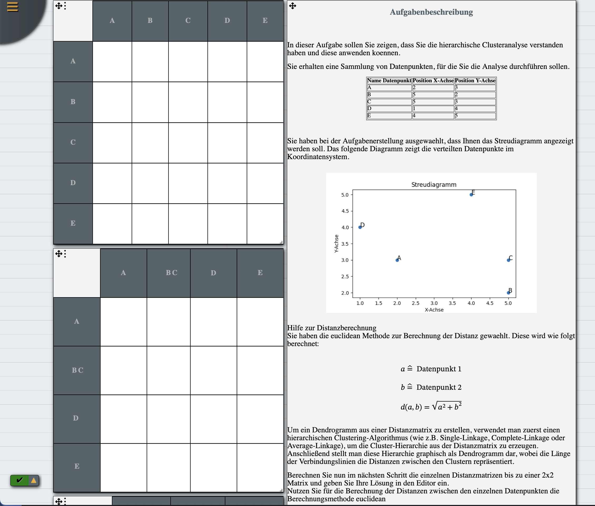
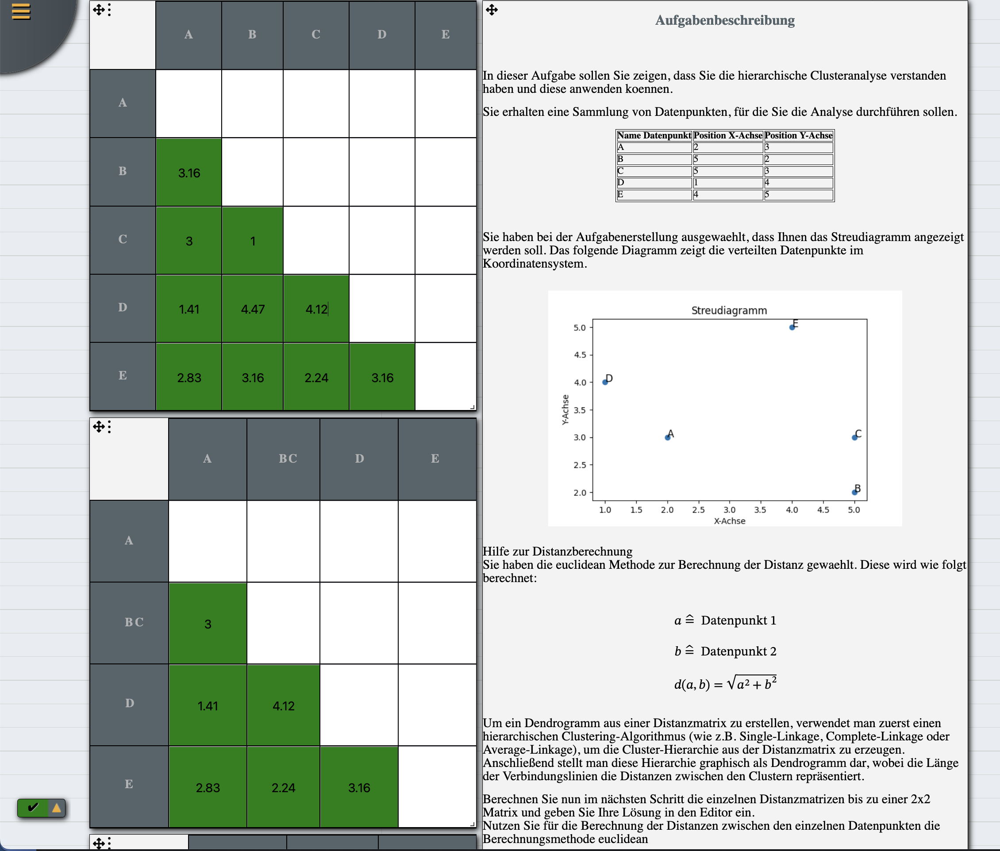

:doctype: book
include::../file-attributes.inc.adoc[]
:imagesdir: images

== Aufgabentyp - {cluster}

=== Aufgabenstellung
Die Aufgabe für das Projektseminar war es, ein Programm zur automatisierten Generierung von Aufgaben für die Hierarchische Clusteranalyse zu erstellen. Das Ziel bestand darin, dass die Studierenden die Durchführung einer hierarchischen Clusteranalyse üben können und Lehrende gleichzeitig ein Tool zu Verfügung gestellt bekommen, mit welchem Sie beliebig viele Aufgaben für die Studierenden erstellen können. Das Programm soll sowohl die Aufgabenstellung für die hierarchische Clusteranalyse, als auch ein Beispieldatenset generieren. Darüber hinaus soll die Ähnlichkeitsmetrik und das Linkkriterium wählbar sein. Aus Output soll ein Dendrogramm ausgeben werden.

Folgend ein Beispiel für eine mögliche Aufgabenstellung:

In dieser Aufgabe sollen Sie zeigen, dass Sie die hierarchische Clusteranalyse verstanden haben und diese anwenden können.
Sie erhalten eine Sammlung von Datenpunkten, für die Sie die Analyse durchführen sollen.

.Table1
[width="80%",options="header"]
|===
|Name Datenpunkt |Position X-Achse |Position Y-Achse
|A | 2 | 3
|B | 5 | 2
|C | 5 | 3
|D | 1 | 4
|E | 4 | 5
|===

1.	Zeichnen Sie im ersten Schritt die Datenpunkte in ein Koordinatensystem als visuelle Hilfe ein.
2.	Berechnen Sie nun im nächsten Schritt die einzelnen Distanzmatrizen bis zu einer 2×2 Matrix und geben Sie Ihre Lösung an. Nutzen Sie für die Berechnung der Distanzen zwischen den einzelnen Datenpunkten die Euklidische Distanz als Berechnungmethode sowie als Linkkriterium Single-Linkage

=== Aufgabenbeschreibung

=== Anforderung
Aus diesen Gegebenheiten ergeben sich folgende Anforderungen an die Software:
-	Zufällige Generierung von Datensets
-	Umsetzung mindestens einer Methode zur Berechnung der Distanz
-	Umsetzung mindestens eines Linkkriteriums
-	Generierung der Aufgabe sowie der Lösung (Schrittweise inkl. aller Zwischenschritte)
-	Verwendung realistischer Wertebereiche
-   Ausgabe eines Dendrogramms

=== Planung

=== Technische Umsetzung
====Entwicklung des Proof of Concept
Um sicherzustellen, dass die gestellte Aufgabe mittels der ALADIN- & CARPET Frameworks gelöst werden kann, wurde im ersten Schritt ein Proof of Conecpt (nachfolgend mit POC abgekürzt) erstellt, um die Machbarkeit zu überprüfen. Der POC bestand dabei aus einem Python Script, welche über ein CLI bedient wird. Die Anforderungen an den POC waren vor allem die Abbildung des Algorithmus zum Schrittweisen lösen der hierarchischen Clusteranalyse. Im ersten POC wurde sich, um bestehende Bibliotheken nicht neu zu scheiben und die zu Verfügung stehende Zeit effizient zu nutzen, die Python Bibliothek „scipy“ gewählt, welche bereits Methoden zur Durchführung der hierarchischen Clusteranalyse bietet. Nachdem ca. 75% des POC fertig gestellt waren musste ich jedoch feststellen, dass die verbleibenden 25% nur zu realisieren wären, wenn ich die „scipy“ Bibliothek forken und stark modifizieren würde. Diese Option schloss ich jedoch aus, da absehbar war, dass in Zukunft keine Ressourcen zum maintainen des Forks zu Verfügung stehen würden. Daraufhin verwarf ich einen Großteil des POC und entwickelt selbst ein skript mit allen notwendigen Methoden, um die hierarchische Clusteranalyse durchzuführen und die dabei verwendeten Algorithmen zu verwenden zu können.
Da bei der schriftlichen Lösung hierarchischen Clusteranalyse pro Iterationsschritt eine Distanzmatrix erstellt und dabei die Distanzen zwischen den einzelnen Datenpunkten berechnet werden, entschied ich mich dazu, diese Berechnung genauso in dem Python Script abzubilden. So war es mit möglich, Distanzmatrizen für alle Iterationsschritte zu erstellen. Die Python Bibliothek „scipy“ bietet im Vergleich dazu nur die Möglichkeit, ein Dendrogramm zu erstellen, aber nicht sich schrittweise diese Distanzmatrizen ausgeben zu lassen. Dies war der Hauptpunkt, weshalb ich mich gegen die Bibliothek entschied und die Funktionalität vollständig selbst entwickelte.
Der zweite POC war somit in der Lage, auf Basis eines vorher zu definierenden Datensets die hierarchische Clusteranalyse durchzuführen und die Lösung für jede Iteration und somit für jede Distanzmatrix zu berechnen. Darüber hinaus setze ich im POC auch direkt die Generierung eines Dendrogramms auf Grundlage der zuvor durchgeführten Berechnungen um.
Mittels des POC war es mir somit möglich zu zeigen, dass sich die schriftliche Lösung der hierarchischen Clusteranalyse vollständig abbilden lässt. Gelichzeitig bildete der entwickelte POC die Grundlage für die drauf folgende Entwicklung eines Programms zur Durchführung der Clusteranalyse mittels ALADIN.

====Allgemeine Architektur
Die Software besteht einerseits aus dem ALADIN Framework, welches das Backend der Anwendung bildet, sowie dem CARPET Framework, welche ein Frontend in Form einer graphischen Weboberfläche zu Verfügung stellt. 

Aufgrund des zu vor umgesetzten POC mittels Python entschied ich mich dazu, dass das ALADIN Framework den bereits vorhanden Python Code mittels CLI aufruft, und die Daten, welche das Python Script zurückliefert, nimmt und anschließend verarbeitet. So war es mir möglich ein Großteil des Codes in Python zu schreiben und nur für den Datenaustausch zwischen dem Python Script und ALADIN das ALADIN Framework mittels Typescript zu modifizieren. Dazu entwickelte ich eine neue Komponente inkl. Aufruf und Verarbeitungsprozedere in Typescript, mit welcher es mir möglich war, dass ALADIN nun Python Scripte ausführen, Daten an das Script zu übergeben und die Daten, welche das Python Script zurück gibt, zu lesen.
Die Umsetzung dieser Funktionalität sieht wie folgt aus:

[source, Typescript]
---
import { exec } from "child_process";
import fs from "fs";
const path = require("path");

function runPythonScript(scriptPath: string, args: any): Promise<string> {
	try {
		return new Promise((resolve, reject) => {
			const command = `python3 ${scriptPath} ${args.join(" ")}`;
			console.log(command);
			exec(command, (error, stdout, stderr) => {
				if (error) {
					reject(error.message);
					return;
				}
				if (stderr) {
					reject(stderr);
					return;
				}
				resolve(stdout);
			});
		});
	} catch {
		console.log("Error");
	}
}

export async function clusterAnalysisMain(parameter: any) {
	let result = { foo: "bar" };
    console.log("PARAMETER:");
	console.log(parameter);
	try {
		let pythonScriptPath = "clusterAnalysis.py";
		pythonScriptPath = path.join(__dirname, pythonScriptPath);
		const argumentsToPythonScript = [...Object.values(parameter), ...parameter["nodeRange"]];
		(await runPythonScript(pythonScriptPath, argumentsToPythonScript)) as any;
		result = JSON.parse(fs.readFileSync(path.join(__dirname, "data.json"), "utf-8"));
        console.log(result);
	} catch (error) {
		console.error("Error running Python script:", error);
	}
	return result;
}
---

Über diese Komponente wird das Python Script mit den entsprechenden Parametern, welches es aus dem Aufruf aus dem Frontend (durch CARPET) mitbekommt, aufgerufen. Das Script führt die Clusteranalyse Schritt für Schritt durch und gibt die Daten zur Abfrage der Nutzereingabe sowie die Ergebnisse zurück an da ALADIN Framework. Das ALADIN Framework wiederrum sendet die Daten weiter an das Frontend, in welchem die Daten genutzt werden um die Weboberfläche zu generieren und es dem Nutzer zu ermöglichen seine Lösungen einzugeben und direkt kontrollieren zu lassen. Der Kontrollmechanismus funktioniert dabei mittels Javascript, d.h., dass die Daten zur Lösung bereits an das Frontend mitgeben werden und während der Nutzer die Lösung eingibt keine weitere Kommunikation zwischen Frontend und Backend stattfinden muss.

Die Oberfläche, die der Nutzer vorfindet, bevorer die Aufgabe lösen kann sieht wie folgt aus:

Hier hat er die Wahl, ob er sich entprechende Hilfen anzeigen lassen möchte oder nicht. Die Implementierung von Hilfen war nicht im ursprünglichen Scope enthalten, jedoch wurde in Abstimmung mit Herrn Paul Christ entschieden, dass es eine durchaus nützliche Funktionalität darstellt und deshalb mit implementiert.
Nachdem der Nutzer die für ihn und seinen Anwendungsfall passenden Werte eingebeben bzw. ausgewähl hat, kann er auf den "Generieren" Button klicken, eine Aufagbe generieren zu lassen. Dabei wird ihm dirket ein Streudiagramm angezeigt, so dass er sehen kann, ob die generierte Aufgabe seinen Anforderungen genügt.

Insofern dies zutrifft, kann der Nutzer die nächste Seite aufrufen oder eine neue Aufgabe generieren.
Sofern der Nutzer sich entscheidet die Aufgabe zu lösen, sieht die Oberfläche wie folgt aus:

Dort kann er nun noch einmal die Aufgabenstellung lesen und die Aufgabe lösen, sowie seine Lösungen in die Eingabemaske eintragen und direkt sehen, ob seine Lösungen richtig waren oder er die Berechnung aufgrund eines Fehlers nochmal erneut durchführen muss.

Insofen die eingegebenen Lösungen richtig sind, werden diese grün hinterlegt.x

=== Ergebnisse
Die gesetzten Ziele wurden soweit vollständig erreicht. Es lässt sich somit sagen, dass das Programm zur Generierung von Aufgaben zur hierarchischen Clusteranalyse funktioniert und bereit für den Praxiseinsatz ist.
Nachfolgend ein Vergelich der IST- und SOLL Stände:

.Table2
[width="80%",options="header"]
|===
|Anforderung (SOLL) |Aktueller Stand (IST)
|Zufällige Generierung von Datensets | gelöst (mittels in Python umgesetzer Generierungsfunktion)
|Umsetzung mindestens einer Methode zur Berechnung der Distanz | gelöst (mittels in Python umgesetzer Berechnungsfunktion), es wurden in Summe sogar zwei Berechnungsmethoden umgesetzt
|Umsetzung mindestens eines Linkkriteriums | gelöst (mittels in Python umgesetzer Berechnungsfunktion)
|Generierung der Aufgabe sowie der Lösung (Schrittweise inkl. aller Zwischenschritte) | gelöst (mittels in Python umgesetzer Berechnungsfunktion)
|Verwendung realistischer Wertebereiche | gelöst (mittels in Eingabevalidierung in CARPET sowie nochmals in Python)
|Ausgabe eines Dendrogramms | gelöst (aktuell mittels scipy Bibliothek, Ausgabe eines Bildes mit einem Dendrogramm möglich, im nächsten Schritt muss das zeichnen und validieren des Dendrogramms in CARPET umgesetzt werden)
|===

Die Umsetzung in ALADIN und CARPET stellte den umfangreichsten Teil und zeitintensivsten Teil des Projektsemniars dar. Vor allem das Fehlen einer Dokumentation stellte eine große Herausforderung dar und resultierte darin, dass viel Zeit in das Testen, Ausprobieren und Verstehen des ALADIN & CARPET Frameworks investiert werden mussten. Oft stieß ich auf für mich unlösbare Herausforderungen, welche ich nur dank der Unterstützung von Herrn Paul Christ lösen konnte. Rückblickend betrachtet wäre es für mich deutlich effektiver gewesen, mithilfe einer Dokumentation schneller in die Frameworks einzutachen und so die dadurch verbleibende Zeit in den Ausbau des Tool zu investieren.

=== Ausblick
Eine Möglichkeit das aktuelle Programm zu erweitern wäre, die bereits bestehende Komponente in ALDIN zum Erstellen von Diagrammen der DOT Notation zu modifizieren, so dass es Nutzern ermöglicht wird Dendrogramme per Drag&Drop zu erstellen und anschließend mit der Musterlösung zu vergleichen. So wäre es möglich den Prozess der schriftlichen Lösung einer Durchführung einer hierarchischen Clusteranalyse vollständig digital abzubilden und direkt kontrollieren zu lassen. Aufgrund der begrenzten Zeit war es mir nicht möglich, dieses Feature zu implementieren. Es ist jedoch meiner Meinung nach mit dem aktuellen Stand des Programms eine sehr gute Grundlage für die Erweiterung von genau solchen Features geschaffen wurden. Vor allem im Hinblick auf die eigentliche Aufgabenstellung, wurden die Anforderungen übererfüllt und bieten nun eine sehr gute Grundlage für die Implementierung weiterer Features. Ein weiteres dieser Features könnte beispielsweise auch die Umsetzung weiterer Ähnlichkeitsmetriken und Linkkriterien sein. Die in der Lehre auf häufigsten verwendeten wurde bereits umgesetzt, jedoch kann durch die Erweiterung um weitere Metriken es ambitionierten Studenten ermöglicht werde, auch diese zu üben und zu verinnerlichen.
